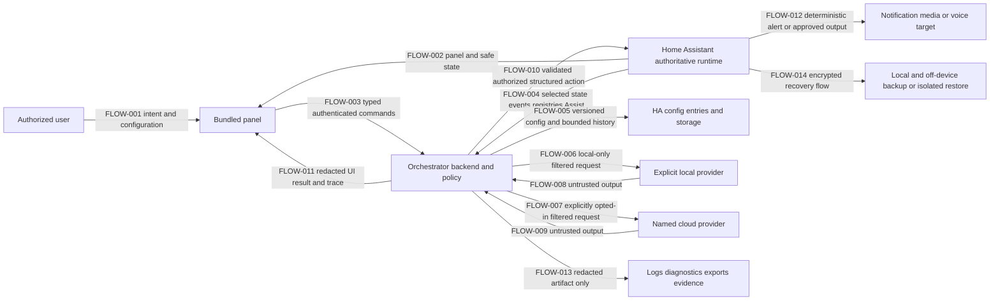

# Data-flow and control-to-test traceability

Status: FND-013 implementation under review

Catalog: [`traceability/traceability.json`](traceability/traceability.json)

Schema: [`traceability/traceability.schema.json`](traceability/traceability.schema.json)

## Purpose and claim boundary

This record gives the project stable IDs for product requirements, protected data, trust-zone nodes, data flows, security controls, and test specifications. The JSON catalog is the machine-checkable source; this document is its readable map.

`planned` means the product behavior or test does not yet exist. `phase0_verified` and `phase0_passed` mean only the narrow foundation evidence named in the catalog exists. They do not mark a provider adapter, workflow engine, chat agent, cloud route, or action-capable product feature delivered. Every product requirement remains planned at FND-013.

No live hostname, address, entity, person, target, credential, recovery key, backup identifier, prompt, provider response, or account identifier belongs in either traceability artifact.

## Condensed data-flow view

The critical asymmetry is intentional: model output returns only to the backend. It cannot call Home Assistant, an output target, storage, or a browser directly. `FLOW-010` is the sole planned model-influenced side-effect crossing and remains guarded by typed tools, current authorization, exact validation, risk policy, confirmation, and idempotency controls.

### Node register

| ID | Trust-zone component |
|---|---|
| NODE-USER | Authorized administrator or permitted household user |
| NODE-FRONTEND | Bundled panel in an authenticated HA session |
| NODE-BACKEND | Integration backend, policy, workflow, redaction, provider contract |
| NODE-HA | Authoritative HA authentication, state, registries, events, actions, Assist, notifications |
| NODE-STORE | HA config entries and versioned integration storage |
| NODE-LOCAL-PROVIDER | Explicit local AI endpoint |
| NODE-CLOUD-PROVIDER | Explicit cloud provider endpoint |
| NODE-OUTPUT | Approved notification, media, or voice target |
| NODE-ARTIFACT | Logs, diagnostics, traces, exports, fixtures, evidence |
| NODE-BACKUP | Encrypted backup locations and isolated restore environment |

## Protected data classes

| ID | Data | Required handling |
|---|---|---|
| DATA-CREDENTIAL | Provider credentials, HA auth context, approval tokens, recovery keys | Platform/backend-only; never frontend/provider context/artifact output |
| DATA-HOUSEHOLD | State, events, presence, security, location, calendar, camera, voice, targets | Deny by default; explicitly scope, minimize, destination-filter, redact |
| DATA-CONTENT | User input, prompts, model context/output, tool arguments/results | Untrusted; delimit, validate, retain only by policy; no hidden reasoning |
| DATA-CONFIG | Provider options, workflows, routes, policies, UI settings, schemas | Admin-authorized, versioned, validated, migratable; exports omit secrets |
| DATA-CONTROL | Tools, action arguments/targets, approvals, execution state, HA context | Typed, allowlisted, reauthorized immediately before action; no blind replay |
| DATA-TELEMETRY | Health, duration, usage, errors, audit metadata, diagnostics | Bounded and recursively redacted; content excluded by default |
| DATA-RECOVERY | Encrypted backup, emergency-kit material, migration/restore evidence | Off-device protection; no committed key; isolated restore only |

## Trust zones and flows

| Flow | From → to | Boundary and data | Enforcing controls | Required tests |
|---|---|---|---|---|
| FLOW-001 | User → panel | Authenticated intent/configuration enters browser session | CTRL-AUTH-001, CTRL-SECRET-001 | TEST-AUTHORIZATION-MATRIX, TEST-NO-BROWSER-PROVIDER, TEST-SECRET-EGRESS |
| FLOW-002 | HA → panel | Platform state becomes browser-visible | CTRL-AUTH-001, CTRL-SECRET-001, CTRL-RED-001, CTRL-COMPAT-001 | TEST-AUTHORIZATION-MATRIX, TEST-SECRET-EGRESS, TEST-REDACTION-CANARY, TEST-COMPAT-LIFECYCLE |
| FLOW-003 | Panel → backend | Browser input enters privileged integration code | CTRL-AUTH-001, CTRL-SECRET-001, CTRL-OUTPUT-001 | TEST-AUTHORIZATION-MATRIX, TEST-SECRET-EGRESS, TEST-OUTPUT-SCHEMA |
| FLOW-004 | HA → backend | Selected authoritative data becomes untrusted workflow context | CTRL-AUTH-001, CTRL-PRIVACY-001, CTRL-TOOL-001 | TEST-AUTHORIZATION-MATRIX, TEST-CLOUD-PRIVACY, TEST-TOOL-ALLOWLIST |
| FLOW-005 | Backend → HA storage | Runtime data becomes persistent configuration/history | CTRL-SECRET-001, CTRL-RETENTION-001, CTRL-RED-001, CTRL-COMPAT-001 | TEST-SECRET-EGRESS, TEST-RETENTION-DELETION, TEST-REDACTION-CANARY, TEST-COMPAT-LIFECYCLE |
| FLOW-006 | Backend → local provider | Selected context leaves HA for an explicit LAN endpoint | CTRL-SECRET-001, CTRL-PRIVACY-001, CTRL-ENDPOINT-001, CTRL-PROVIDER-001 | TEST-SECRET-EGRESS, TEST-CLOUD-PRIVACY, TEST-ENDPOINT-SSRF, TEST-PROVIDER-CONTRACT, TEST-LOCAL-AUTH-NETWORK |
| FLOW-007 | Backend → cloud provider | Opted-in filtered context leaves the private network | CTRL-SECRET-001, CTRL-PRIVACY-001, CTRL-ENDPOINT-001, CTRL-PROVIDER-001 | TEST-SECRET-EGRESS, TEST-CLOUD-PRIVACY, TEST-ENDPOINT-SSRF, TEST-PROVIDER-CONTRACT |
| FLOW-008 | Local provider → backend | Untrusted local model output re-enters privileged code | CTRL-PROVIDER-001, CTRL-OUTPUT-001, CTRL-TOOL-001, CTRL-RED-001 | TEST-PROVIDER-CONTRACT, TEST-OUTPUT-SCHEMA, TEST-TOOL-ALLOWLIST, TEST-REDACTION-CANARY |
| FLOW-009 | Cloud provider → backend | Untrusted remote model output re-enters privileged code | CTRL-PROVIDER-001, CTRL-OUTPUT-001, CTRL-TOOL-001, CTRL-RED-001 | TEST-PROVIDER-CONTRACT, TEST-OUTPUT-SCHEMA, TEST-TOOL-ALLOWLIST, TEST-REDACTION-CANARY |
| FLOW-010 | Backend → HA | Validated model-influenced structure approaches a side effect | CTRL-TOOL-001, CTRL-ACTION-001, CTRL-IDEMPOTENCY-001, CTRL-ALERT-001 | TEST-TOOL-ALLOWLIST, TEST-ACTION-CONFIRMATION, TEST-IDEMPOTENT-RESTART, TEST-DETERMINISTIC-ALERT |
| FLOW-011 | Backend → panel | Redacted status, destination, validation, result, and trace become visible | CTRL-SECRET-001, CTRL-RED-001, CTRL-PRIVACY-001, CTRL-RETENTION-001 | TEST-SECRET-EGRESS, TEST-REDACTION-CANARY, TEST-CLOUD-PRIVACY, TEST-RETENTION-DELETION |
| FLOW-012 | HA → output | Deterministic alert or approved output leaves HA | CTRL-AUTH-001, CTRL-ALERT-001, CTRL-ACTION-001 | TEST-AUTHORIZATION-MATRIX, TEST-DETERMINISTIC-ALERT, TEST-ACTION-CONFIRMATION |
| FLOW-013 | Backend → artifact | Runtime data becomes persistent/shareable evidence or support material | CTRL-SECRET-001, CTRL-RED-001, CTRL-RETENTION-001 | TEST-SECRET-EGRESS, TEST-REDACTION-CANARY, TEST-RETENTION-DELETION |
| FLOW-014 | HA → backup/restore | Protected installation data leaves live HA for recovery | CTRL-BACKUP-001, CTRL-SECRET-001, CTRL-RED-001 | TEST-BACKUP-CREATE, TEST-BACKUP-RESTORE, TEST-SECRET-EGRESS |

## Control register

| Control | Enforced rule | Current status |
|---|---|---|
| CTRL-AUTH-001 | Preserve HA authentication/context and authorize configuration, approval, and use | Phase 0 verified only for current admin-bounded foundation surfaces |
| CTRL-SECRET-001 | Backend-only credentials with no echo, artifact leakage, or cross-origin redirect | Design only |
| CTRL-RED-001 | Recursive secret/household redaction plus deterministic canary scanning | Phase 0 canary/evidence harness verified; product redactor not implemented |
| CTRL-PRIVACY-001 | Minimal explicit context, local default, cloud opt-in, prohibited-field filtering | Design only; owner defaults recorded |
| CTRL-ENDPOINT-001 | Validate provider scheme/origin/redirect/DNS/IP and credential destination | Design only |
| CTRL-PROVIDER-001 | One provider contract with probed capability and normalized failure behavior | Design only |
| CTRL-OUTPUT-001 | Strictly validate all provider output before structured use | Design only |
| CTRL-TOOL-001 | Typed narrow tools only; no generic action executor | Design only; Phase 0 probe is action-free but product tools do not exist |
| CTRL-ACTION-001 | Risk policy, prohibited actions, exact confirmation, current state/context recheck | Design only; owner action matrix remains a later decision |
| CTRL-IDEMPOTENCY-001 | Journal side effects and prevent duplicate/replayed/recursive action | Design only; Phase 0 lifecycle probe has no side effect |
| CTRL-ALERT-001 | Deterministic primary safety/security path unaffected by AI | Design only |
| CTRL-RETENTION-001 | Bounded owner-approved retention and deletion semantics | Design only; owner defaults recorded |
| CTRL-COMPAT-001 | Named-version lifecycle, migration, panel, and upgrade evidence | Phase 0 same-version lifecycle verified; actual Core-upgrade artifact remains open |
| CTRL-BACKUP-001 | Encrypted off-device backup, protected recovery material, isolated restore cadence | Phase 0 backup creation/policy verified; first restore artifact remains due |

## Requirement traceability

All rows remain `planned`. The IDs map the approved source text; they do not replace it.

| Requirement | Short meaning | Primary flows | Primary controls | Acceptance tests |
|---|---|---|---|---|
| REQ-CAP-001 | UI-configured provider connections behind one contract | FLOW-001, 003, 005–009 | CTRL-AUTH-001, SECRET-001, ENDPOINT-001, PROVIDER-001 | TEST-AUTHORIZATION-MATRIX, SECRET-EGRESS, ENDPOINT-SSRF, PROVIDER-CONTRACT |
| REQ-CAP-002 | Live HA entity/device/area/state/action discovery | FLOW-004, 011 | CTRL-AUTH-001, PRIVACY-001, RED-001 | TEST-AUTHORIZATION-MATRIX, CLOUD-PRIVACY, REDACTION-CANARY |
| REQ-CAP-003 | Per-agent/workflow observation/action/privacy/confirmation scopes | FLOW-003–005, 010 | CTRL-AUTH-001, PRIVACY-001, TOOL-001, ACTION-001 | TEST-AUTHORIZATION-MATRIX, CLOUD-PRIVACY, TOOL-ALLOWLIST, ACTION-CONFIRMATION |
| REQ-CAP-004 | Visual deterministic workflow with constrained AI and failures | FLOW-004–010 | CTRL-OUTPUT-001, TOOL-001, ACTION-001, IDEMPOTENCY-001, COMPAT-001 | TEST-OUTPUT-SCHEMA, TOOL-ALLOWLIST, ACTION-CONFIRMATION, IDEMPOTENT-RESTART, COMPAT-LIFECYCLE |
| REQ-CAP-005 | Compose/classify/extract/branch/bounded conversation-tool modes | FLOW-006–009 | CTRL-PROVIDER-001, OUTPUT-001, TOOL-001 | TEST-PROVIDER-CONTRACT, OUTPUT-SCHEMA, TOOL-ALLOWLIST |
| REQ-CAP-006 | Chat and Assist conversation agent | FLOW-001, 003, 004, 006–009, 011 | CTRL-AUTH-001, PRIVACY-001, PROVIDER-001, TOOL-001, RETENTION-001 | TEST-AUTHORIZATION-MATRIX, CLOUD-PRIVACY, PROVIDER-CONTRACT, TOOL-ALLOWLIST, RETENTION-DELETION |
| REQ-CAP-007 | Live-available HA announcements/notifications | FLOW-004, 010, 012 | CTRL-AUTH-001, ACTION-001, IDEMPOTENCY-001 | TEST-AUTHORIZATION-MATRIX, ACTION-CONFIRMATION, IDEMPOTENT-RESTART |
| REQ-CAP-008 | Named routes, health, safe failover, visible destination | FLOW-006–009, 011 | CTRL-PRIVACY-001, ENDPOINT-001, PROVIDER-001, IDEMPOTENCY-001 | TEST-CLOUD-PRIVACY, ENDPOINT-SSRF, PROVIDER-CONTRACT, IDEMPOTENT-RESTART |
| REQ-CAP-009 | Dry run, exact context preview, redacted trace, restart safety | FLOW-003, 005, 010, 011, 013 | CTRL-RED-001, PRIVACY-001, IDEMPOTENCY-001, RETENTION-001, COMPAT-001 | TEST-REDACTION-CANARY, CLOUD-PRIVACY, IDEMPOTENT-RESTART, RETENTION-DELETION, COMPAT-LIFECYCLE |
| REQ-CAP-010 | AI cannot replace life-safety detection or unrestricted action policy | FLOW-004, 010, 012 | CTRL-TOOL-001, ACTION-001, ALERT-001, IDEMPOTENCY-001 | TEST-TOOL-ALLOWLIST, ACTION-CONFIRMATION, DETERMINISTIC-ALERT, IDEMPOTENT-RESTART |
| REQ-CON-001 | Private personal-use distribution | FLOW-001–003 | CTRL-AUTH-001, COMPAT-001 | TEST-AUTHORIZATION-MATRIX, COMPAT-LIFECYCLE |
| REQ-CON-002 | HA is authoritative for state and action | FLOW-004, 010, 012 | CTRL-AUTH-001, ACTION-001, COMPAT-001 | TEST-AUTHORIZATION-MATRIX, ACTION-CONFIRMATION, COMPAT-LIFECYCLE |
| REQ-CON-003 | No browser-direct provider credentials or requests | FLOW-001–003, 006, 007 | CTRL-SECRET-001, ENDPOINT-001 | TEST-NO-BROWSER-PROVIDER, SECRET-EGRESS, ENDPOINT-SSRF |
| REQ-CON-004 | No generic unrestricted model action tool | FLOW-008–010 | CTRL-TOOL-001, ACTION-001 | TEST-TOOL-ALLOWLIST, ACTION-CONFIRMATION |
| REQ-CON-005 | No cloud disclosure without workflow authorization | FLOW-007, 009, 011 | CTRL-PRIVACY-001, RED-001 | TEST-CLOUD-PRIVACY, REDACTION-CANARY |
| REQ-CON-006 | YAML is not the primary UX | FLOW-001, 003, 005, 011 | CTRL-AUTH-001, OUTPUT-001, COMPAT-001 | TEST-AUTHORIZATION-MATRIX, OUTPUT-SCHEMA, COMPAT-LIFECYCLE |
| REQ-CON-007 | No unverified capability claim | FLOW-004, 006–009 | CTRL-PROVIDER-001, COMPAT-001 | TEST-PROVIDER-CONTRACT, COMPAT-LIFECYCLE, LOCAL-AUTH-NETWORK |
| REQ-CON-008 | No inferred high-risk owner policy | FLOW-001, 003, 010 | CTRL-AUTH-001, ACTION-001, TOOL-001 | TEST-AUTHORIZATION-MATRIX, ACTION-CONFIRMATION, TOOL-ALLOWLIST |
| REQ-ACC-001 | UI-configurable, safe test, destination-transparent, offline-tolerant, redacted acceptance | FLOW-001, 003, 006, 007, 010, 011, 013 | CTRL-AUTH-001, PRIVACY-001, PROVIDER-001, ACTION-001, RED-001, IDEMPOTENCY-001 | TEST-AUTHORIZATION-MATRIX, CLOUD-PRIVACY, PROVIDER-CONTRACT, ACTION-CONFIRMATION, REDACTION-CANARY, IDEMPOTENT-RESTART |

## Test registry and current evidence state

| Test ID | Required proof | Status |
|---|---|---|
| TEST-AUTHORIZATION-MATRIX | Admin/non-admin configure/read/approve/invoke matrix with HA context | Planned |
| TEST-NO-BROWSER-PROVIDER | Browser has neither provider credential nor direct provider request | Planned |
| TEST-SECRET-EGRESS | Credential lifecycle and every egress remain secret-free | Planned |
| TEST-REDACTION-CANARY | Synthetic secret/household canary absent from artifacts | Phase 0 passed for existing harness/artifacts only |
| TEST-CLOUD-PRIVACY | Sanitized requests prove local default, opt-in, minimization, deny rules, failover boundary | Planned |
| TEST-ENDPOINT-SSRF | URL/redirect/DNS/IP/userinfo/metadata corpus | Planned |
| TEST-PROVIDER-CONTRACT | Common capability/error/timeout/cancel/stream/tool/schema behavior | Planned |
| TEST-OUTPUT-SCHEMA | Malformed/extra/ambiguous/stale/policy-expanding output rejected | Planned |
| TEST-TOOL-ALLOWLIST | Prompt/output cannot expand tool, target, argument, or permission scope | Planned |
| TEST-ACTION-CONFIRMATION | Risk/prohibition/exact confirmation/expiry/state/auth recheck | Planned |
| TEST-IDEMPOTENT-RESTART | Retry/failover/reload/restart/cancel/re-entry yields zero or one side effect | Planned |
| TEST-DETERMINISTIC-ALERT | Primary alert survives every AI failure and injection mode | Planned |
| TEST-RETENTION-DELETION | Retention defaults, deletion, exports, and no hidden reasoning | Planned |
| TEST-COMPAT-LIFECYCLE | Named-version lifecycle/panel/migration/actual upgrade | Phase 0 same-version portion passed; Core-upgrade artifact open |
| TEST-LOCAL-AUTH-NETWORK | Missing/invalid auth rejection, valid HA request, hardened reachability | Phase 0 passed for observed LM Studio environment |
| TEST-BACKUP-CREATE | Encrypted automatic/off-device backup, emergency-kit custody, schedule | Phase 0 passed for observed HA environment |
| TEST-BACKUP-RESTORE | Spare/isolated restore on cadence and after major changes | Planned; first artifact due by 2027-02-23 or earlier trigger |
| TEST-CATALOG-INTEGRITY | Schema, unique IDs, resolved refs, requirement coverage, evidence status | Implemented by `tests/quality/test_traceability.py`; acceptance pending FND-013 review |

## Maintenance rule

Every future implementation task must reference at least one `REQ-*`, `CTRL-*`, and `TEST-*` ID in its tracker/evidence. If the task adds a new data class, node, boundary, or egress, update the JSON catalog and this map in the same reviewed change. A test may move from `planned` only when its evidence reference exists and the evidence says exactly what passed. A requirement may move from `planned` only when all applicable phase-gate acceptance evidence exists; foundation evidence alone is insufficient.
